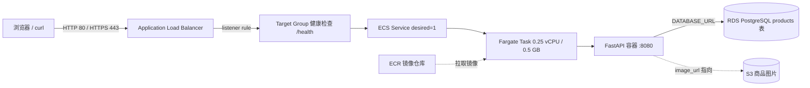

# Product Service 作业指南

依据 2026-09-23 与老师的会议记录整理。目标是让你看懂每一步在干什么，而不只是照抄命令。

状态标记：本文件会随着实际操作更新。"已完成"表示本机或 AWS 上已验证；"待做"表示还没执行。

---

## 0. 老师这次说了什么

### 0.1 对你现有 API / DB 设计的反馈

- 老师问 AI usage 记在哪：答案是第 6 张表 `ai_usage`，老师确认。
- 老师问比较额度时是否要数 `ai_usage` 有多少行：不用。`ai_quota` 表里有 `quota_limit`、`used_units`、`reserved_units`，剩余次数 = `quota_limit - used_units - reserved_units`。
- 老师追问：既然只有这几个数字，为什么要单独建 `ai_quota` 表，能不能直接放进 `users` 表？结论是"这个问题我们之后再改"。所以这次不改设计，只记为待定项（已写进 `AIProductDesign/API_DB_DESIGN_V2.md` 的 Pending decisions）。

### 0.2 这次的作业

1. 做 **Product Service**（商品模块），老师说这是整个项目最简单的一块。
2. 接口是你课上报的这几个：新增商品、查商品列表、按 ID 查商品、下架商品、更新商品。
3. 数据库用 AWS **RDS**。
4. 去网上找一些商品模板图片，存到 **S3**，把图片 URL 存进数据库。
5. 实现完之后，按课上讲的方法**部署到 AWS**（Docker 镜像 → ECR → ECS Fargate → ALB）。
6. 下节课讲 CloudFormation，这次不涉及。

### 0.3 课上讲的部署知识（一句话版）

| 名词 | 它是什么 | 一句话理解 |
|---|---|---|
| Docker image | 把代码 + Python + 依赖打成一个可搬运的包 | "装好一切的压缩包" |
| ECR | AWS 的镜像仓库，类似 Docker Hub | "放镜像的仓库" |
| ECS | AWS 的容器管理服务，负责容器生命周期 | "容器管家" |
| Fargate | serverless 的容器运行方式，不用自己买/维护服务器 | "按需借来的机器，AWS 负责维护" |
| Task Definition | 容器运行说明书：用哪个镜像、开哪个端口、多少 CPU/内存、哪些环境变量 | "说明书，不是正在运行的东西" |
| ECS Service | 按说明书启动 Task，并保持指定数量（desired count）一直运行 | "保证一直有 N 个容器活着" |
| ALB | Application Load Balancer，对外统一入口，负责转发、健康检查、HTTPS | "大门 + 保安" |
| Target Group | ALB 把请求转给哪些容器，以及怎么做健康检查 | "大门后面的名单" |

老师对比的四种方案：EC2（最自由、运维最多）→ ECS on EC2（编排有了、机器还得自己管）→ **ECS + Fargate（本课选择，性价比平衡点）** → EKS（Kubernetes，最强也最复杂）。

Fargate 帮你省掉：买服务器、扩容（可以配 CPU > 60% 自动加 task）、容器崩了自动拉起（self-healing）、操作系统补丁。Fargate 不帮你管：镜像里的依赖、Python 版本、环境变量——这些是应用层，仍然是开发者的事。

HTTPS：浏览器到 ALB 用 HTTPS（加密），ALB 解密后在 AWS 内网用普通 HTTP 转给容器。所以应用代码完全不用管证书，本地和线上跑的是同一个镜像。证书由 ACM 签发并自动续期，绑在 ALB 的 443 listener 上（个人网站是绑在 CloudFront 上，这是区别）。

---

## 1. 目标架构



一次请求的路径：用户 → ALB（80/443）→ Target Group → 某个健康的 Task → 容器里的 FastAPI → 读写 RDS → 返回 JSON。图片文件不经过 FastAPI，数据库里只存 S3 的 URL，前端拿到 URL 直接去 S3 取图。

---

## 2. Product Service 设计

### 2.1 表 `products`

```
id            uuid PK
name          varchar(120)
description   text?
price_cents   integer CHECK(>= 0)     -- 用整数分，避免小数误差
currency      char(3) DEFAULT 'USD'
image_url     text?                   -- S3 图片地址
status        text CHECK(ACTIVE, INACTIVE)
created_at    timestamptz
updated_at    timestamptz
```

### 2.2 接口

| 方法 / 路径 | 作用 | 成功状态码 | 说明 |
|---|---|---|---|
| `POST /products` | 新增商品 | 201 | 请求体见下 |
| `GET /products` | 商品列表 | 200 | 默认只返回 ACTIVE；`?include_inactive=true` 看全部；支持 `limit` / `offset` |
| `GET /products/{id}` | 单个商品 | 200 / 404 | 下架的也能按 ID 查到，`status` 会显示 INACTIVE |
| `PUT /products/{id}` | 更新商品 | 200 / 404 | 只传要改的字段；可把 `status` 改回 `ACTIVE` 重新上架 |
| `DELETE /products/{id}` | 下架商品 | 204 / 404 | 软删除：只把 `status` 改成 INACTIVE，不物理删行 |
| `GET /health` | 健康检查 | 200 | 给 ALB 用 |

`POST /products` 请求体示例：

```json
{
  "name": "Wooden Desk Lamp",
  "description": "Minimalist oak lamp with warm LED",
  "price_cents": 4999,
  "currency": "USD",
  "image_url": "https://<bucket>.s3.amazonaws.com/products/lamp.jpg"
}
```

"下架 = 软删除"是按老师原话"下架 delete"的理解。如果老师要求物理删除，把 `app/routers/products.py` 里的 `delete_product` 改成 `db.delete(product)` 即可。

### 2.3 技术选型

- FastAPI + Uvicorn（和 hello 作业一致）
- SQLAlchemy 2.0 + psycopg 3 连接 PostgreSQL
- 应用启动时 `create_all` 自动建表（作业够用；正式项目应改用 Alembic 迁移）
- 本地用 Docker 跑 PostgreSQL 16；线上用 RDS。两者只差一个环境变量 `DATABASE_URL`

---

## 3. 阶段 A：本地开发（不花钱）

### 步骤 1：项目结构

```
ProductService/
├── app/
│   ├── main.py            # 创建 FastAPI 应用、/health、启动时建表
│   ├── db.py              # 读取 DATABASE_URL，创建数据库连接
│   ├── models.py          # products 表的 SQLAlchemy 定义
│   ├── schemas.py         # 请求/响应的 Pydantic 模型（校验输入）
│   └── routers/
│       └── products.py    # 5 个商品接口
├── scripts/
│   └── seed_products.py   # 用 POST /products 批量写入种子商品
├── seed/products.json     # 种子商品数据（图片 URL 指向 S3）
├── tests/test_products.py # 用 SQLite 内存库跑一遍 CRUD
├── Dockerfile
├── docker-compose.yml     # 本地 Postgres + 应用
├── requirements.txt
├── .env.example
└── README.md
```

在干什么：把"连数据库"、"表长什么样"、"输入合法性检查"、"接口逻辑"分成不同文件，以后加 User / AI 模块时照这个结构往 `routers/` 里加就行。

### 步骤 2：本地跑起来

```powershell
cd C:\Users\shu_pu\Desktop\Govalley\ProductService
python -m venv .venv
.\.venv\Scripts\python.exe -m pip install -r requirements.txt -r requirements-dev.txt
docker compose up -d db                 # 只起数据库
.\.venv\Scripts\python.exe -m uvicorn app.main:app --reload --port 8080
```

打开 http://localhost:8080/docs，Swagger 里能看到 5 个 products 接口和 /health。

在干什么：`docker compose up -d db` 用容器起一个 PostgreSQL，省去在 Windows 装数据库。`--reload` 让你改代码后自动重启。不设置 `DATABASE_URL` 时，代码默认连本地这个容器；`.env.example` 只是提醒线上要换成 RDS 地址。

### 步骤 3：验证 CRUD

```powershell
# 新增
curl.exe -s -X POST http://localhost:8080/products -H "Content-Type: application/json" -d "{\"name\":\"Test Mug\",\"price_cents\":1299}"
# 列表
curl.exe -s http://localhost:8080/products
# 按 ID（把 <id> 换成上一步返回的 id）
curl.exe -s http://localhost:8080/products/<id>
# 更新
curl.exe -s -X PUT http://localhost:8080/products/<id> -H "Content-Type: application/json" -d "{\"price_cents\":999}"
# 下架
curl.exe -s -i -X DELETE http://localhost:8080/products/<id>
# 下架后默认列表看不到，但 include_inactive=true 能看到
curl.exe -s "http://localhost:8080/products?include_inactive=true"
```

自动化测试（不需要 Postgres，用 SQLite 内存库）：

```powershell
.\.venv\Scripts\python.exe -m pytest -q
```

### 步骤 4：构建 Docker 镜像

```powershell
docker build -t product-service:local .
docker compose up -d                     # 同时起 db 和 api 两个容器
curl.exe -s http://localhost:8080/health
docker compose down                      # 关掉；加 -v 会连数据一起删
```

在干什么：确认"打成镜像后也能跑"。线上 Fargate 跑的就是这个镜像，只是 `DATABASE_URL` 换成 RDS。

### 步骤 5：Git 与 GitHub

```powershell
git init -b main
git add .
git commit -m "feat: product service CRUD with PostgreSQL"
gh auth status                            # 先看当前活动账号
gh repo create <account>/ProductService --public --source . --remote origin --push
```

提交前检查 `git status`，确保 `.env`、`.venv/`、`__pycache__/` 都被 `.gitignore` 排除。

---

## 4. 阶段 B：部署到 AWS

每一步先说"在干什么"，再给命令。所有命令都在 `us-east-1`。

前置：老师课上让大家配置 AWS CLI 的那一步（`aws --version` → IAM 用户 → Access Key → `aws configure` → `aws sts get-caller-identity`）在你的机器上已经做完：CLI 2.36，IAM 用户 `Shu`，账号 `608799855296`。为什么需要 CLI：S3 有网页可以拖拽上传，ECR 没有，推镜像必须靠命令行。

### 步骤 6：S3 存商品图片

在干什么：图片是文件，放对象存储 S3；数据库只存 URL。桶名全球唯一。

```powershell
$BUCKET = "shu-product-images-608799855296"
aws s3 mb s3://$BUCKET --region us-east-1
# 允许桶内 products/ 前缀公开读（图片要让浏览器能直接打开）
aws s3api put-public-access-block --bucket $BUCKET --public-access-block-configuration BlockPublicAcls=true,IgnorePublicAcls=true,BlockPublicPolicy=false,RestrictPublicBuckets=false
# 把 aws/s3-public-read-policy.template.json 里的 BUCKET_NAME 换成真实桶名后再执行
aws s3api put-bucket-policy --bucket $BUCKET --policy file://aws/s3-public-read-policy.local.json
# 上传图片
aws s3 cp .\seed\images\ s3://$BUCKET/products/ --recursive
```

图片 URL 形如 `https://$BUCKET.s3.amazonaws.com/products/<文件名>`，写进 `seed/products.json`。

### 步骤 7：RDS PostgreSQL

在干什么：线上数据库。选最小规格控制费用；只允许 ECS 任务的安全组访问 5432 端口，不对公网开放。应用启动时自己建表，所以不需要从本机直连 RDS。

```powershell
# 安全组：ECS 任务用、RDS 用
aws ec2 create-security-group --group-name product-ecs-sg --description "ECS tasks" --vpc-id <default-vpc-id>
aws ec2 create-security-group --group-name product-rds-sg --description "RDS from ECS" --vpc-id <default-vpc-id>
aws ec2 authorize-security-group-ingress --group-id <rds-sg> --protocol tcp --port 5432 --source-group <ecs-sg>
# 数据库实例（约 5–10 分钟可用）
aws rds create-db-instance --db-instance-identifier product-db --engine postgres --db-instance-class db.t4g.micro --allocated-storage 20 --storage-type gp3 --master-username productadmin --master-user-password <强密码> --db-name products --vpc-security-group-ids <rds-sg> --no-publicly-accessible --no-multi-az --backup-retention-period 0
aws rds wait db-instance-available --db-instance-identifier product-db
aws rds describe-db-instances --db-instance-identifier product-db --query "DBInstances[0].Endpoint.Address"
```

`DATABASE_URL = postgresql+psycopg://productadmin:<密码>@<endpoint>:5432/products`

### 步骤 8：ECR 推镜像

在干什么：把本地镜像上传到 AWS 的镜像仓库，Fargate 才能拉到。注意平台：Windows Docker 默认构建 `linux/amd64`，Task Definition 里的 CPU 架构要选 X86_64 与之匹配。

```powershell
$ACCOUNT = "608799855296"; $REGION = "us-east-1"
aws ecr create-repository --repository-name product-service
aws ecr get-login-password --region $REGION | docker login --username AWS --password-stdin "$ACCOUNT.dkr.ecr.$REGION.amazonaws.com"
docker build --platform linux/amd64 -t product-service .
docker tag product-service:latest "$ACCOUNT.dkr.ecr.$REGION.amazonaws.com/product-service:latest"
docker push "$ACCOUNT.dkr.ecr.$REGION.amazonaws.com/product-service:latest"
```

这四条就是控制台里 "View push commands" 显示的四条：登录、构建、打标签、推送。

### 步骤 9：ECS Cluster + Task Definition

在干什么：Cluster 只是逻辑分组。Task Definition 是说明书：镜像、8080 端口、0.25 vCPU / 0.5 GB（最便宜的组合）、环境变量 `DATABASE_URL`、日志送到 CloudWatch。还需要一个执行角色让 ECS 有权拉 ECR 镜像和写日志。

```powershell
aws ecs create-cluster --cluster-name product-cluster
aws iam create-role --role-name productEcsTaskExecutionRole --assume-role-policy-document file://aws/ecs-task-trust.json
aws iam attach-role-policy --role-name productEcsTaskExecutionRole --policy-arn arn:aws:iam::aws:policy/service-role/AmazonECSTaskExecutionRolePolicy
aws logs create-log-group --log-group-name /ecs/product-service
# 把 aws/task-definition.template.json 里的 ACCOUNT_ID / REGION / DATABASE_URL_VALUE 填好，另存为 .local.json（已被 .gitignore 排除）
aws ecs register-task-definition --cli-input-json file://aws/task-definition.local.json
```

`DATABASE_URL` 含数据库密码，所以填好的 `.local.json` 不能提交到 Git。作业阶段先用明文环境变量；正式项目应改成 Secrets Manager / SSM Parameter Store 引用。

### 步骤 10：ALB + ECS Service

在干什么：ALB 是大门，监听 80；Target Group 记录"把请求转给哪些容器、用 `/health` 检查活不活"；Service 按说明书启动 1 个 Task，并把它注册到 Target Group。控制台里"创建 Service 时勾选 Load balancing"一步生成的就是这些资源（背后是 CloudFormation，5–10 分钟）。

```powershell
aws ec2 create-security-group --group-name product-alb-sg --description "ALB public" --vpc-id <default-vpc-id>
aws ec2 authorize-security-group-ingress --group-id <alb-sg> --protocol tcp --port 80 --cidr 0.0.0.0/0
aws ec2 authorize-security-group-ingress --group-id <ecs-sg> --protocol tcp --port 8080 --source-group <alb-sg>

aws elbv2 create-load-balancer --name product-alb --subnets <subnet-a> <subnet-b> --security-groups <alb-sg>
aws elbv2 create-target-group --name product-tg --protocol HTTP --port 8080 --vpc-id <vpc> --target-type ip --health-check-path /health
aws elbv2 create-listener --load-balancer-arn <alb-arn> --protocol HTTP --port 80 --default-actions Type=forward,TargetGroupArn=<tg-arn>

aws ecs create-service --cluster product-cluster --service-name product-service --task-definition product-service --desired-count 1 --launch-type FARGATE --network-configuration "awsvpcConfiguration={subnets=[<subnet-a>,<subnet-b>],securityGroups=[<ecs-sg>],assignPublicIp=ENABLED}" --load-balancers "targetGroupArn=<tg-arn>,containerName=product-service,containerPort=8080"
aws ecs wait services-stable --cluster product-cluster --services product-service
```

`assignPublicIp=ENABLED`：默认 VPC 没有 NAT，Task 需要公网 IP 才能去 ECR 拉镜像。

### 步骤 11：验证

在干什么：老师课上是到 EC2 → Load Balancers 找 DNS name。CLI 等价：

```powershell
aws elbv2 describe-load-balancers --names product-alb --query "LoadBalancers[0].DNSName" --output text
curl.exe -s http://<alb-dns>/health
curl.exe -s http://<alb-dns>/products
# 写入种子商品（图片 URL 指向 S3）
.\.venv\Scripts\python.exe scripts\seed_products.py --base-url http://<alb-dns>
```

浏览器打开 `http://<alb-dns>/docs` 就是线上的 Swagger。

### 步骤 12（可选）：HTTPS + 域名

在干什么：ACM 申请 `api.shupu.me` 证书 → ALB 加 443 listener 绑证书 → Route 53 加 A 记录（Alias）指向 ALB。老师说可以复用个人网站域名加 `api.` 前缀。

```powershell
aws acm request-certificate --domain-name api.shupu.me --validation-method DNS
# 按输出在 Route 53 加 CNAME 验证记录，等 ISSUED
aws ec2 authorize-security-group-ingress --group-id <alb-sg> --protocol tcp --port 443 --cidr 0.0.0.0/0
aws elbv2 create-listener --load-balancer-arn <alb-arn> --protocol HTTPS --port 443 --certificates CertificateArn=<cert-arn> --default-actions Type=forward,TargetGroupArn=<tg-arn>
# Route 53：api.shupu.me A 记录 Alias → ALB
```

### 步骤 13：费用与收尾

按 us-east-1 按需价格粗估（不算免费额度）：

| 资源 | 约每月 |
|---|---|
| ALB 固定费 | ~$16 + 公网 IPv4 ~$7 |
| Fargate 0.25 vCPU / 0.5 GB × 1 task | ~$9 + 公网 IPv4 ~$4 |
| RDS db.t4g.micro + 20 GB gp3 | ~$12 + ~$2 |
| S3 / ECR / CloudWatch | 几美分到 $1 |
| 合计 | 约 $50 / 月 |

演示完不用时：

```powershell
aws ecs update-service --cluster product-cluster --service product-service --desired-count 0   # 停容器，不删配置
aws rds stop-db-instance --db-instance-identifier product-db                                   # 停库（最多停 7 天后自动启动）
```

彻底删除：`aws ecs delete-service --force` → `aws elbv2 delete-load-balancer` / `delete-target-group` → `aws rds delete-db-instance --skip-final-snapshot` → `aws ecr delete-repository --force` → `aws s3 rb --force`。

---

## 5. 演示时怎么讲

1. 用户能做什么：增、查、改、下架商品，图片存 S3。
2. 打开线上 Swagger，`POST` 一条商品，`GET` 列表看到它，`DELETE` 后默认列表消失、`include_inactive=true` 还在。
3. 指着架构图讲一次请求的路径：ALB → Target Group → Fargate Task → FastAPI → RDS。
4. 讲为什么选 Fargate 不选 EC2，Task Definition 与 Service 的区别，ALB 的健康检查在看 `/health`。
5. 提老师上次反馈：`ai_quota` 是否合并进 `users`，待下次讨论。

---

## 6. 实际执行记录

### 2026-09-23 阶段 A 已完成

- 代码：`Govalley/ProductService`，GitHub 私有仓库 https://github.com/seanpushu/ProductService（提交 `0aa7be4`）。需要交给老师时可改为公开：`gh repo edit seanpushu/ProductService --visibility public`。
- 单元测试：`pytest` 3 个用例通过（SQLite 内存库）。
- 本地 PostgreSQL 16（compose）验证：`POST` 201 → `GET` 列表 total=1 → `GET /{id}` → `PUT` 改价 999 → `DELETE` 204 → 默认列表 total=0、`include_inactive=true` 显示 INACTIVE → 不存在 ID 返回 404。`\d products` 确认 9 个字段、主键与 `price_cents >= 0` 检查约束都建出来了。
- Docker：`product-service:local` 构建成功，`linux/amd64`，约 70 MB；`docker compose up --build` 里 api 容器 `/health` 返回 ok 并能读到 db 里的数据。
- 设计文档：`AIProductDesign/API_DB_DESIGN_V2.md` 已补 02 Product Service 五个接口、Table 9 `products`、Relationships 一行，以及 Pending decisions 里老师提出的 `ai_quota` 合并问题。

### 阶段 B 未开始（你选择暂不创建 AWS 资源）

- 已核实账号状态：默认 VPC `vpc-04c34e1e3e6f6fc87`（us-east-1a–f 六个子网；部署时避开 1e，Fargate/ALB 在该可用区支持不全）；账号级 S3 Block Public Access 未开启，所以桶级公开读策略可用；无现存 RDS / ECS 集群；ECR 里有一个旧仓库 `tmp`；Route 53 已有 `shupu.me` 托管区，可申请 `api.shupu.me`。
- 商品图片：你决定自己找图。把图片放到 `seed/images/`，文件名与 `seed/products.json` 里的 `image_url` 末尾一致（`oak-desk-lamp.png` 等，格式可改，改了就同步改 JSON）。
- HTTPS：你选择要做，但它依赖 ALB 先存在，所以随阶段 B 一起执行。
- 开始阶段 B 时，从步骤 6 起按顺序执行；每一步的命令都在上面。
